# GitForAI User Guide

A comprehensive guide to using GitForAI for semantic search over Git repository history.

## Table of Contents

1. [Overview](#overview)
2. [System Architecture](#system-architecture)
3. [Installation](#installation)
4. [Quick Start](#quick-start)
5. [Command Reference](#command-reference)
6. [Workflows](#workflows)
7. [Advanced Usage](#advanced-usage)
8. [Troubleshooting](#troubleshooting)

---

## Overview

GitForAI extracts Git repository history, enriches it with AI analysis, and stores it in a vector database for fast semantic search. Ask natural language questions about your codebase history and get relevant results instantly.

### Key Features

- **Zero-Cost by Default**: Uses local embeddings (sentence-transformers) - completely free
- **Semantic Search**: Find commits using natural language queries
- **Rich Metadata**: AI-extracted intent, topics, and summaries
- **Hybrid Search**: Combine semantic similarity with metadata filters
- **Incremental Updates**: Re-index only new commits with upsert operations
- **Fast Queries**: ChromaDB vector database for millisecond search

### Use Cases

- **Code Archaeology**: Find when and why specific changes were made
- **Bug Investigation**: Search for similar bug fixes across history
- **Feature Discovery**: Find related features and implementations
- **Team Onboarding**: Help new developers understand codebase evolution
- **Code Review**: Find similar past changes for reference
- **Documentation**: Generate accurate historical documentation

---

## System Architecture

### High-Level Architecture

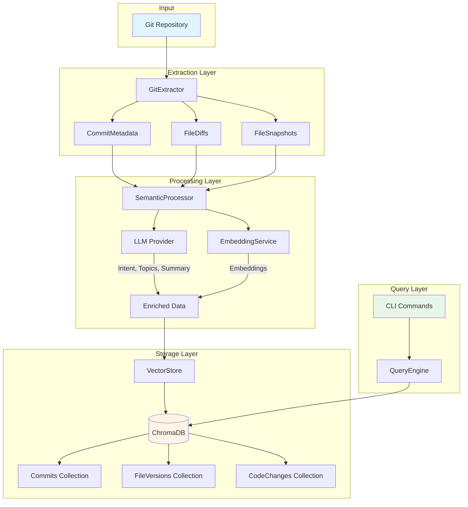

### Data Flow: Index Command

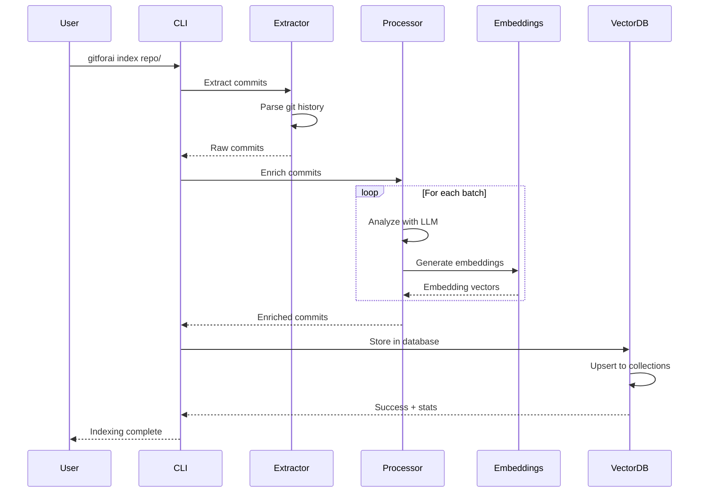

### Data Flow: Search Command

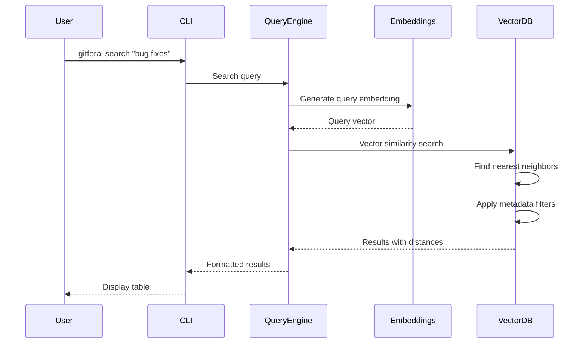

### Database Schema

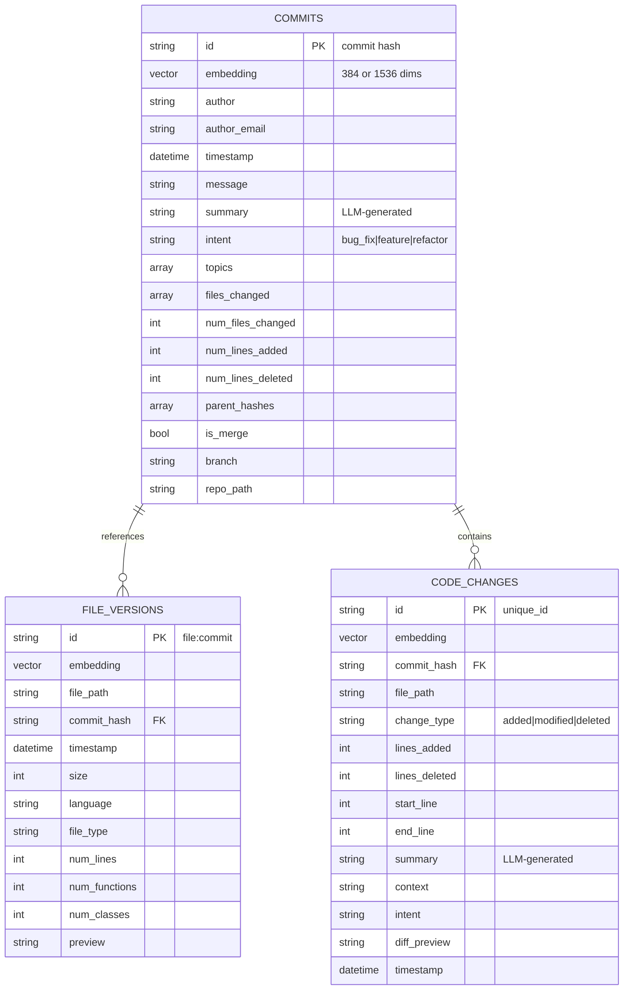

---

## Installation

### Prerequisites

- Python 3.10 or higher
- Git installed and accessible
- 2GB+ free disk space (for local embeddings model)

### Install Options

#### Option 1: Full Installation (Recommended)

Install all features including vector database and local embeddings:

```bash
pip install 'gitforai[vectordb,local-embeddings]'
```

#### Option 2: Vector Database Only

If you only want to use OpenAI embeddings:

```bash
pip install 'gitforai[vectordb,llm]'
```

#### Option 3: Development Installation

For development or contributing:

```bash
git clone https://github.com/yourusername/gitforai.git
cd gitforai
pip install -e '.[dev,vectordb,local-embeddings]'
```

### Verify Installation

```bash
gitforai version
gitforai --help
```

### First-Time Setup

The first time you use local embeddings, the model will be downloaded (~80MB):

```bash
# This will download the all-MiniLM-L6-v2 model
gitforai index /path/to/small/repo --max-commits 5
```

---

## Docker Usage

GitForAI provides Docker support for containerized deployment and reproducible environments.

### Docker Architecture

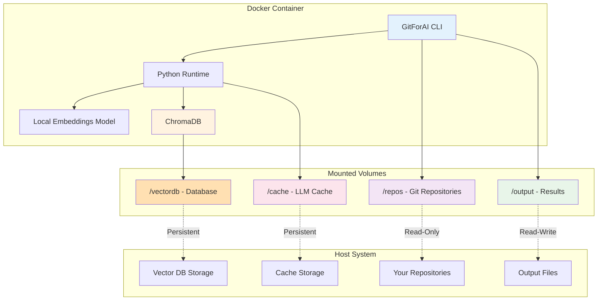

### Quick Docker Start

#### 1. Build the Docker Image

```bash
# Build production image
docker-compose build

# Or build development image
docker-compose -f docker-compose.dev.yml build
```

#### 2. Index a Repository

```bash
# Index repository with local embeddings
docker-compose run --rm gitforai index /repos/myrepo --max-commits 50

# With verbose output
docker-compose run --rm gitforai index /repos/myrepo --max-commits 50 -v
```

#### 3. Search Indexed Commits

```bash
# Semantic search
docker-compose run --rm gitforai search "authentication bug fixes"

# Search with filters
docker-compose run --rm gitforai search "database" --intent feature
```

#### 4. Check Database Stats

```bash
docker-compose run --rm gitforai db-stats
```

### Docker Volume Mounts

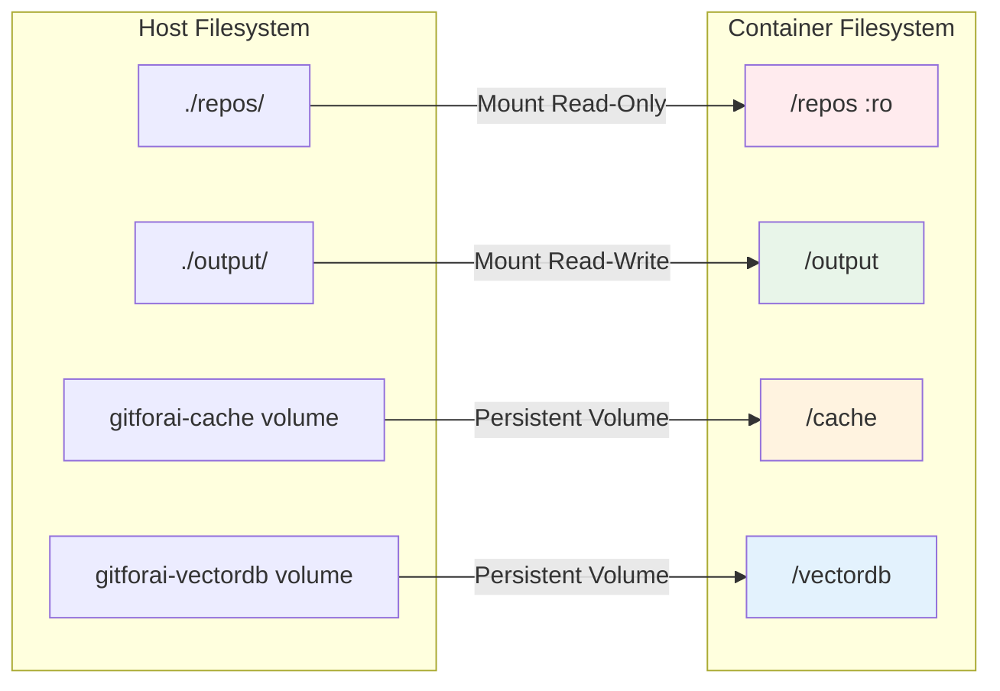

**Volume Descriptions:**

| Volume Path | Purpose | Persistence | Access |
|-------------|---------|-------------|--------|
| `/repos` | Git repositories to analyze | Host directory | Read-only |
| `/output` | Extracted/enriched data output | Host directory | Read-write |
| `/cache` | LLM response cache | Docker volume | Persistent |
| `/vectordb` | ChromaDB storage | Docker volume | Persistent |

### Docker Workflow Example

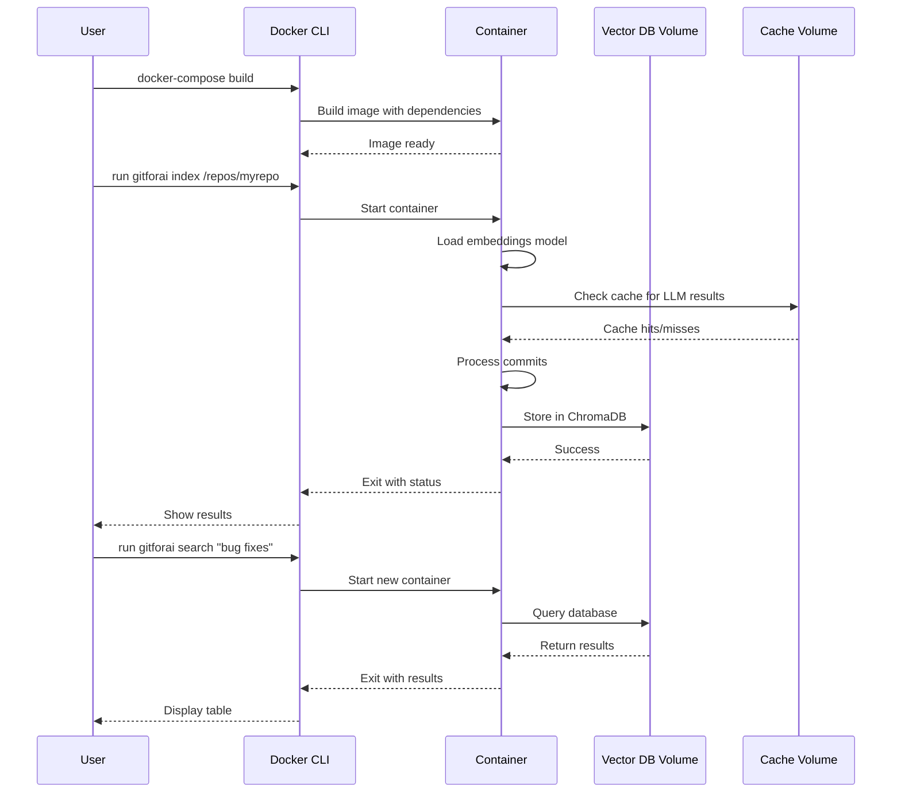

### Docker Commands Reference

#### Basic Commands

```bash
# Build image
docker-compose build

# Index repository
docker-compose run --rm gitforai index /repos/myrepo

# Search commits
docker-compose run --rm gitforai search "your query"

# Database operations
docker-compose run --rm gitforai db-stats
docker-compose run --rm gitforai db-reset --yes

# Other commands
docker-compose run --rm gitforai extract /repos/myrepo
docker-compose run --rm gitforai analyze /repos/myrepo abc123
docker-compose run --rm gitforai list-commits /repos/myrepo
```

#### With OpenAI Embeddings

```bash
# Set API key in environment
export OPENAI_API_KEY=sk-...

# Index with OpenAI embeddings
docker-compose run --rm gitforai index /repos/myrepo \
  --embedding-provider openai \
  --api-key $OPENAI_API_KEY
```

#### Custom Configuration

Create `docker-compose.override.yml`:

```yaml
version: '3.8'

services:
  gitforai:
    volumes:
      # Mount your specific repository
      - /path/to/your/repo:/repos/myrepo:ro
      - ./my-output:/output

    environment:
      # Use OpenAI by default
      - EMBEDDING_PROVIDER=openai
      - OPENAI_API_KEY=${OPENAI_API_KEY}

    # Default command
    command: index /repos/myrepo --max-commits 100
```

Then simply run:
```bash
docker-compose up
```

### Development with Docker

#### Interactive Shell

```bash
# Start development container with shell
docker-compose -f docker-compose.dev.yml run --rm dev

# Inside container:
gitforai --help
python -m pytest tests/
python -c "from gitforai import __version__; print(__version__)"
```

#### Run Tests

```bash
# Run all tests
docker-compose -f docker-compose.dev.yml run --rm test

# Run specific test file
docker-compose -f docker-compose.dev.yml run --rm test pytest tests/unit/test_storage.py -v

# Run with coverage
docker-compose -f docker-compose.dev.yml run --rm test pytest --cov=gitforai
```

#### Code Linting

```bash
# Run linters and formatters
docker-compose -f docker-compose.dev.yml run --rm lint
```

### Volume Management

#### List Volumes

```bash
# List all GitForAI volumes
docker volume ls | grep gitforai
```

#### Inspect Volume

```bash
# Check volume details
docker volume inspect gitforai-vectordb
docker volume inspect gitforai-cache
```

#### Backup Vector Database

```bash
# Create backup of vector database
docker run --rm \
  -v gitforai-vectordb:/source:ro \
  -v $(pwd)/backups:/backup \
  alpine tar czf /backup/vectordb-backup-$(date +%Y%m%d).tar.gz -C /source .
```

#### Restore Vector Database

```bash
# Restore from backup
docker run --rm \
  -v gitforai-vectordb:/target \
  -v $(pwd)/backups:/backup \
  alpine tar xzf /backup/vectordb-backup-20251106.tar.gz -C /target
```

#### Clear Volumes

```bash
# Remove cache (frees disk space)
docker volume rm gitforai-cache

# Remove vector database (CAREFUL: deletes all indexed data)
docker volume rm gitforai-vectordb

# Or use db-reset command
docker-compose run --rm gitforai db-reset --yes
```

### Docker Image Management

#### Check Image Size

```bash
docker images gitforai
```

Expected output:
```
REPOSITORY   TAG       IMAGE ID       CREATED         SIZE
gitforai     latest    abc123...      5 minutes ago   850MB
```

**Image Layers:**
- Base: Python 3.10-slim (~150MB)
- Dependencies: PyTorch, sentence-transformers, ChromaDB (~650MB)
- Application code (~50MB)

#### Multi-Stage Build

GitForAI uses multi-stage builds to minimize production image size:

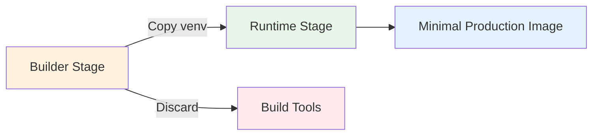

#### Rebuild Image

```bash
# Force rebuild without cache
docker-compose build --no-cache

# Pull latest base images
docker-compose build --pull
```

### Resource Configuration

Default resource limits (configured in `docker-compose.yml`):

```yaml
deploy:
  resources:
    limits:
      cpus: '2.0'      # Maximum 2 CPU cores
      memory: 2G       # Maximum 2GB RAM
    reservations:
      cpus: '0.5'      # Minimum 0.5 CPU cores
      memory: 512M     # Minimum 512MB RAM
```

#### Adjust Resources

For large repositories or faster processing:

```yaml
# docker-compose.override.yml
version: '3.8'

services:
  gitforai:
    deploy:
      resources:
        limits:
          cpus: '4.0'
          memory: 4G
        reservations:
          cpus: '1.0'
          memory: 1G
```

### Docker Environment Variables

Configure GitForAI behavior with environment variables:

| Variable | Default | Description |
|----------|---------|-------------|
| `EMBEDDING_PROVIDER` | `local` | Embedding provider: `local` or `openai` |
| `EMBEDDING_MODEL` | `all-MiniLM-L6-v2` | Model name for embeddings |
| `OPENAI_API_KEY` | - | OpenAI API key (required for openai provider) |
| `LLM_MODEL` | `gpt-4-turbo-preview` | OpenAI model for completions |
| `VECTORDB_PROVIDER` | `chroma` | Vector database provider |
| `VECTORDB_PERSIST_DIR` | `/vectordb` | Database storage location |
| `VECTORDB_BATCH_SIZE` | `100` | Batch size for database operations |
| `LOG_LEVEL` | `INFO` | Logging level: DEBUG, INFO, WARNING, ERROR |

### Docker Troubleshooting

#### Issue: Permission Denied

**Error:**
```
PermissionError: [Errno 13] Permission denied: '/vectordb'
```

**Solution:**
```bash
# Fix volume permissions
docker-compose run --rm --user root gitforai chown -R gitforai:gitforai /vectordb /cache

# Or recreate volumes
docker-compose down -v
docker-compose up
```

#### Issue: Model Download Fails

**Error:**
```
Connection error while downloading model
```

**Solution:**
```bash
# Pre-download model on host, then mount
# On host:
python -c "from sentence_transformers import SentenceTransformer; SentenceTransformer('all-MiniLM-L6-v2')"

# Or increase timeout
docker-compose run --rm gitforai index /repos/myrepo --max-commits 5
```

#### Issue: Out of Memory

**Error:**
```
Killed (OOM)
```

**Solution:**
```bash
# Increase memory limit
# In docker-compose.override.yml:
services:
  gitforai:
    deploy:
      resources:
        limits:
          memory: 4G
```

#### Issue: Cache Fills Disk

**Solution:**
```bash
# Check cache size
docker system df -v

# Clear cache
docker-compose run --rm gitforai clear-cache --force

# Or remove volume
docker volume rm gitforai-cache
```

### Docker Security

GitForAI Docker setup follows security best practices:

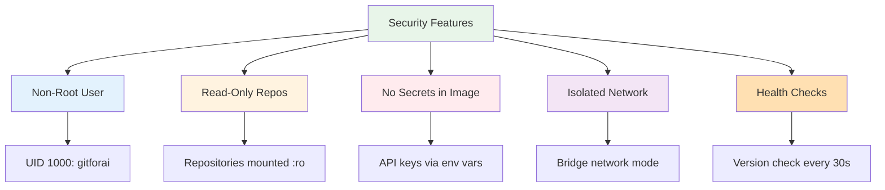

**Security Checklist:**
- ✅ Container runs as non-root user (`gitforai`, UID 1000)
- ✅ Repositories mounted read-only (`:ro` flag)
- ✅ API keys passed via environment, never in image
- ✅ No sensitive data stored in image layers
- ✅ Health checks ensure container integrity
- ✅ Minimal base image (python:3.10-slim)
- ✅ Multi-stage build excludes dev tools

### Docker Best Practices

#### 1. Repository Access Pattern

```bash
# Bad: Mount entire home directory
-v ~:/repos

# Good: Mount specific repository read-only
-v ~/myproject:/repos/myproject:ro
```

#### 2. Persistent Storage

```bash
# Use named volumes for database
volumes:
  - gitforai-vectordb:/vectordb  # Persists across container restarts
```

#### 3. Environment Management

```bash
# Use .env file for configuration
# .env
EMBEDDING_PROVIDER=local
VECTORDB_BATCH_SIZE=100
OPENAI_API_KEY=sk-...

# Docker Compose automatically loads .env
docker-compose run --rm gitforai index /repos/myrepo
```

#### 4. Regular Maintenance

```bash
# Weekly: Prune unused images
docker image prune -f

# Monthly: Backup vector database
docker run --rm \
  -v gitforai-vectordb:/source:ro \
  -v $(pwd)/backups:/backup \
  alpine tar czf /backup/vectordb-$(date +%Y%m%d).tar.gz -C /source .

# As needed: Update base image
docker-compose build --pull
```

---

## Quick Start

### 1. Index Your First Repository

```bash
# Index last 50 commits with local embeddings (free)
gitforai index ~/my-project --max-commits 50
```

Output:
```
Indexing commits from: /home/user/my-project
Embedding Provider: Local (sentence-transformers)
Embedding Model: all-MiniLM-L6-v2
Cost: $0.00 (free, runs locally)
Caching: Enabled

✓ Extracted 50 commits

Enriching with LLM analysis...
✓ Enriched 50 commits

Storing in vector database...
✓ Indexed 50 commits

Vector Database Stats:
  Total Commits: 50
  Provider: chroma
  Persist Dir: .gitforai/vectordb
```

### 2. Search Your Repository

```bash
# Semantic search
gitforai search "authentication bug fixes"
```

Output:
```
Searching for: authentication bug fixes

Found 10 results:

┏━━━━━━━━━━┳━━━━━━━━┳━━━━━━━━━━━━┳━━━━━━━━━━━━━━━━━━━━━━━━━━━━━━━━━━━┓
┃ Hash     ┃  Score ┃ Intent     ┃ Message                           ┃
┡━━━━━━━━━━╇━━━━━━━━╇━━━━━━━━━━━━╇━━━━━━━━━━━━━━━━━━━━━━━━━━━━━━━━━━━┩
│ a7f3c2e1 │  0.892 │ bug_fix    │ Fix password validation bypass    │
│ b4e9d8c3 │  0.874 │ bug_fix    │ Resolve session timeout issue     │
│ c2a1f5d7 │  0.856 │ feature    │ Add two-factor authentication     │
└──────────┴────────┴────────────┴───────────────────────────────────┘
```

### 3. Check Database Statistics

```bash
gitforai db-stats
```

### 4. Search with Filters

```bash
# Filter by intent
gitforai search "database" --intent feature

# Filter by author
gitforai search "bug" --author john@example.com

# Combine filters
gitforai search "api" --intent feature --author alice
```

---

## Command Reference

### `gitforai index`

Index repository commits into the vector database for semantic search.

```bash
gitforai index <repo_path> [OPTIONS]
```

**Arguments:**
- `repo_path`: Path to Git repository (required)

**Options:**
- `--embedding-provider`: Embedding provider: `local` or `openai` (default: `local`)
- `--api-key`: OpenAI API key (for OpenAI provider)
- `--model, -m`: LLM model for completions (default: `gpt-4-turbo-preview`)
- `--embedding-model`: Specific embedding model name
- `--max-commits, -n`: Maximum number of commits to index
- `--branch, -b`: Branch to index (default: `HEAD`)
- `--batch-size`: Batch size for processing (default: `10`)
- `--no-cache`: Disable caching
- `--verbose, -v`: Verbose output

**Examples:**

```bash
# Index last 100 commits with local embeddings
gitforai index ~/my-repo --max-commits 100

# Index entire repository
gitforai index ~/my-repo

# Index specific branch
gitforai index ~/my-repo --branch develop

# Use OpenAI embeddings (higher quality)
gitforai index ~/my-repo --embedding-provider openai --api-key sk-...

# Verbose output with stats
gitforai index ~/my-repo --max-commits 50 --verbose
```

**Process Flow:**


---

### `gitforai search`

Search indexed commits using semantic similarity.

```bash
gitforai search <query> [OPTIONS]
```

**Arguments:**
- `query`: Natural language search query (required)

**Options:**
- `--results, -n`: Number of results to return (default: `10`)
- `--intent`: Filter by intent: `bug_fix`, `feature`, `refactor`, `docs`, `test`, etc.
- `--author`: Filter by author name or email
- `--verbose, -v`: Show detailed information for top result

**Examples:**

```bash
# Basic semantic search
gitforai search "authentication bug fixes"

# Search with filters
gitforai search "database migration" --intent feature
gitforai search "security improvements" --author john@example.com

# Get more results
gitforai search "api endpoints" --results 20

# Detailed view
gitforai search "performance optimization" --verbose
```

**Query Process:**


---

### `gitforai db-stats`

Show vector database statistics and configuration.

```bash
gitforai db-stats
```

**No options required.**

**Example Output:**

```
Vector Database Statistics

Collections:
  commits: 250 documents
  file_versions: 0 documents
  code_changes: 0 documents

Configuration:
  Provider: chroma
  Persist Dir: .gitforai/vectordb
  Embedding Dim: 384
  Distance Metric: cosine
  Batch Size: 100
```

---

### `gitforai db-reset`

Reset (clear) the vector database. Permanently deletes all indexed data.

```bash
gitforai db-reset [OPTIONS]
```

**Options:**
- `--yes, -y`: Skip confirmation prompt

**Examples:**

```bash
# Interactive confirmation
gitforai db-reset

# Skip confirmation
gitforai db-reset --yes
```

⚠️ **Warning**: This permanently deletes all indexed commits. The original Git repository is not affected.

---

### Other Commands

#### `gitforai extract`

Extract commit metadata from a repository (without indexing).

```bash
gitforai extract <repo_path> [OPTIONS]
```

#### `gitforai analyze`

Analyze a specific commit in detail.

```bash
gitforai analyze <repo_path> <commit_hash> [OPTIONS]
```

#### `gitforai list-commits`

List recent commits in a repository.

```bash
gitforai list-commits <repo_path> [OPTIONS]
```

#### `gitforai enrich`

Enrich commits with LLM analysis (without indexing to database).

```bash
gitforai enrich <repo_path> [OPTIONS]
```

---

## Workflows

### Workflow 1: Initial Repository Indexing

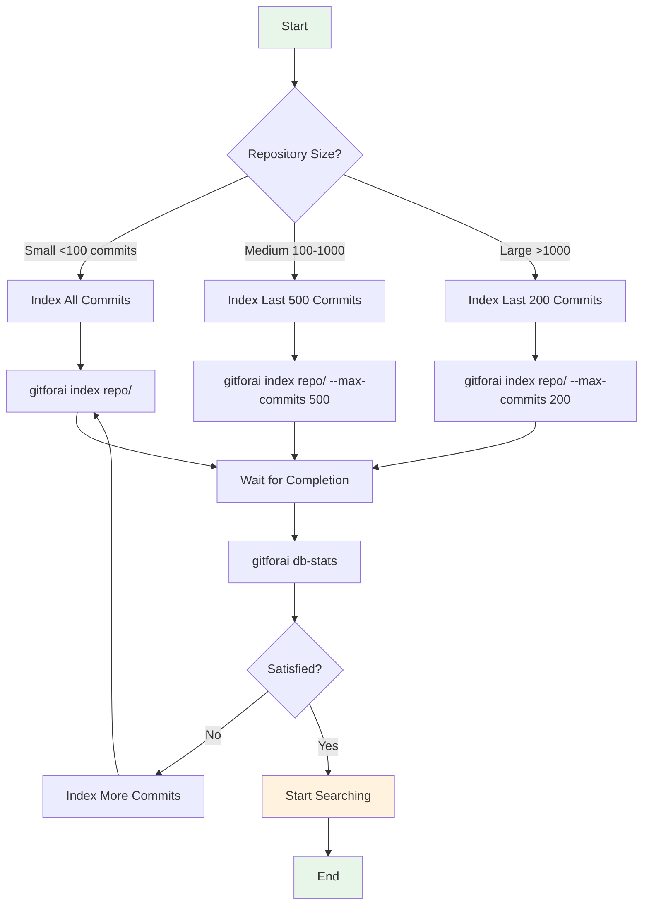

### Workflow 2: Incremental Updates

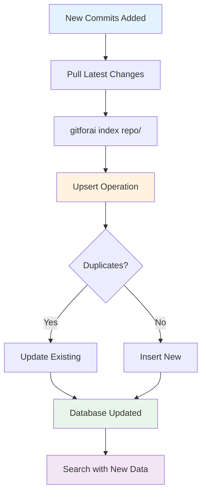

### Workflow 3: Bug Investigation

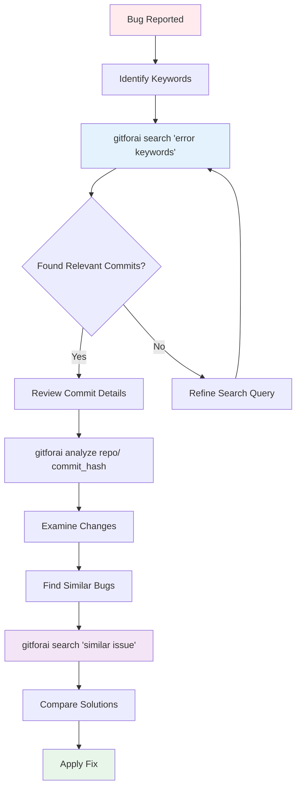

### Workflow 4: Feature Discovery

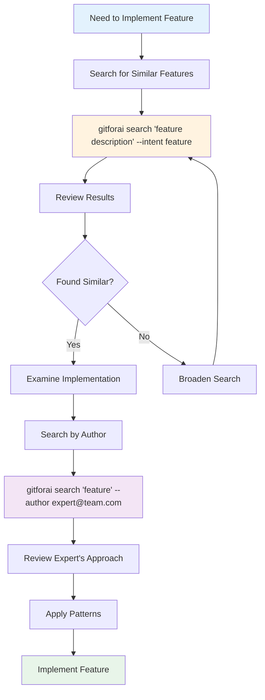

---

## Advanced Usage

### Custom Configuration

Create `.env` file in your project root:

```env
# Vector Database Configuration
VECTORDB_PROVIDER=chroma
VECTORDB_PERSIST_DIR=./.gitforai/vectordb
VECTORDB_COLLECTION_PREFIX=myproject
VECTORDB_EMBEDDING_DIMENSION=384
VECTORDB_DISTANCE_METRIC=cosine
VECTORDB_BATCH_SIZE=100

# OpenAI Configuration (optional)
OPENAI_API_KEY=sk-...
```

### Using OpenAI Embeddings

For higher quality embeddings (~5-7% better accuracy):

```bash
# Set API key
export OPENAI_API_KEY=sk-...

# Index with OpenAI embeddings
gitforai index ~/repo --embedding-provider openai --embedding-model text-embedding-3-small

# Search (automatically uses OpenAI)
gitforai search "your query"
```

**Cost Comparison:**

| Provider | Model | Dimensions | Cost per 1M tokens | Quality |
|----------|-------|------------|-------------------|---------|
| Local | all-MiniLM-L6-v2 | 384 | $0.00 | Good |
| OpenAI | text-embedding-3-small | 1536 | ~$0.02 | Excellent |
| OpenAI | text-embedding-3-large | 3072 | ~$0.13 | Best |

### Programmatic Usage

Use GitForAI as a Python library:

```python
from gitforai.extraction import GitExtractor
from gitforai.llm.processor import SemanticProcessor
from gitforai.llm.local_provider import LocalProvider
from gitforai.llm.embeddings import EmbeddingService
from gitforai.storage import VectorStore, QueryEngine, CommitDocument
from gitforai.models import RepositoryConfig

# Extract commits
config = RepositoryConfig(repo_path="/path/to/repo")
extractor = GitExtractor(config)
commits = list(extractor.extract_all_commits(max_count=10))

# Enrich with LLM
provider = LocalProvider(model="all-MiniLM-L6-v2")
processor = SemanticProcessor(provider)
enriched = await processor.enrich_commits_batch(commits, include_embeddings=True)

# Store in vector database
vector_store = VectorStore()
commit_docs = [
    CommitDocument(
        id=c.hash,
        embedding=c.embedding,
        author=c.author_name,
        author_email=c.author_email,
        timestamp=c.timestamp,
        message=c.message,
        summary=c.llm_summary,
        intent=c.intent,
        topics=c.topics,
        files_changed=c.files_changed,
        num_files_changed=len(c.files_changed),
        num_lines_added=c.stats.insertions if c.stats else 0,
        num_lines_deleted=c.stats.deletions if c.stats else 0,
        parent_hashes=c.parent_hashes,
        is_merge=c.is_merge,
    )
    for c in enriched
]
vector_store.upsert_commits(commit_docs)

# Query
embedding_service = EmbeddingService(provider)
query_engine = QueryEngine(embedding_service=embedding_service)
results = await query_engine.search_commits("bug fixes", n_results=5)

for doc, distance, metadata, commit_id in results:
    print(f"{commit_id}: {metadata['message']} (score: {1-distance:.3f})")
```

---

## Troubleshooting

### Issue: "Local embeddings not available"

**Error:**
```
Error: Local embeddings not available. Install with: pip install 'gitforai[local-embeddings]'
```

**Solution:**
```bash
pip install 'gitforai[local-embeddings]'
```

---

### Issue: "Vector database dependencies not installed"

**Error:**
```
Error: Vector database dependencies not installed.
```

**Solution:**
```bash
pip install 'gitforai[vectordb]'
```

---

### Issue: Model Download Fails

**Error:**
```
Connection error while downloading model
```

**Solution:**
```bash
# Manual download
python -c "from sentence_transformers import SentenceTransformer; SentenceTransformer('all-MiniLM-L6-v2')"
```

---

### Issue: "Collection does not exist"

**Error:**
```
Error: Collection  does not exist
```

**Solution:**
The database is empty. Index some commits first:
```bash
gitforai index /path/to/repo --max-commits 50
```

---

### Issue: Slow Indexing Performance

**Symptoms:**
- Indexing takes a long time
- CPU usage is high

**Solutions:**

1. **Reduce batch size:**
   ```bash
   gitforai index repo/ --batch-size 5
   ```

2. **Index fewer commits initially:**
   ```bash
   gitforai index repo/ --max-commits 50
   ```

3. **Use caching (enabled by default):**
   ```bash
   # Subsequent runs will be faster
   gitforai index repo/
   ```

4. **Use OpenAI (faster but costs money):**
   ```bash
   gitforai index repo/ --embedding-provider openai
   ```

---

### Issue: Out of Memory

**Error:**
```
RuntimeError: [enforce fail at alloc_cpu.cpp:114]
```

**Solutions:**

1. **Reduce batch size:**
   ```bash
   gitforai index repo/ --batch-size 5
   ```

2. **Index in smaller chunks:**
   ```bash
   # Index 100 commits at a time
   gitforai index repo/ --max-commits 100
   ```

---

### Issue: Search Returns No Results

**Symptoms:**
- `gitforai search "query"` returns empty results

**Solutions:**

1. **Check if database has data:**
   ```bash
   gitforai db-stats
   ```

2. **Try broader search terms:**
   ```bash
   # Instead of: "specific function implementation details"
   # Try: "function implementation"
   ```

3. **Remove filters:**
   ```bash
   # Try without filters first
   gitforai search "query"
   ```

---

### Issue: Permission Denied

**Error:**
```
PermissionError: [Errno 13] Permission denied: '.gitforai/vectordb'
```

**Solution:**
```bash
# Check directory permissions
ls -la .gitforai/

# Fix permissions
chmod -R 755 .gitforai/

# Or use a different directory
export VECTORDB_PERSIST_DIR=~/gitforai-db
gitforai index repo/
```

---

## Performance Tips

### 1. Batch Size Tuning

- **Small repos (<100 commits)**: Use default batch size (10)
- **Medium repos (100-1000)**: Increase to 20-50
- **Large repos (>1000)**: Start with 5-10 and increase gradually

```bash
gitforai index repo/ --batch-size 20
```

### 2. Incremental Indexing

Don't re-index the entire repository. GitForAI uses upsert operations:

```bash
# Initial index
gitforai index repo/ --max-commits 100

# Later, index new commits (duplicates will be updated)
gitforai index repo/ --max-commits 150
```

### 3. Caching

Keep caching enabled for repeat operations:

```bash
# Cache enabled (default)
gitforai index repo/

# Cache location: ~/.gitforai/cache/
```

### 4. Search Optimization

- Use filters to narrow results
- Start with broader queries, then refine
- Combine multiple filters for precision

```bash
# Broad search
gitforai search "authentication"

# Refined search
gitforai search "authentication" --intent bug_fix --author security-team
```

---

## Best Practices

### 1. Repository Indexing Strategy

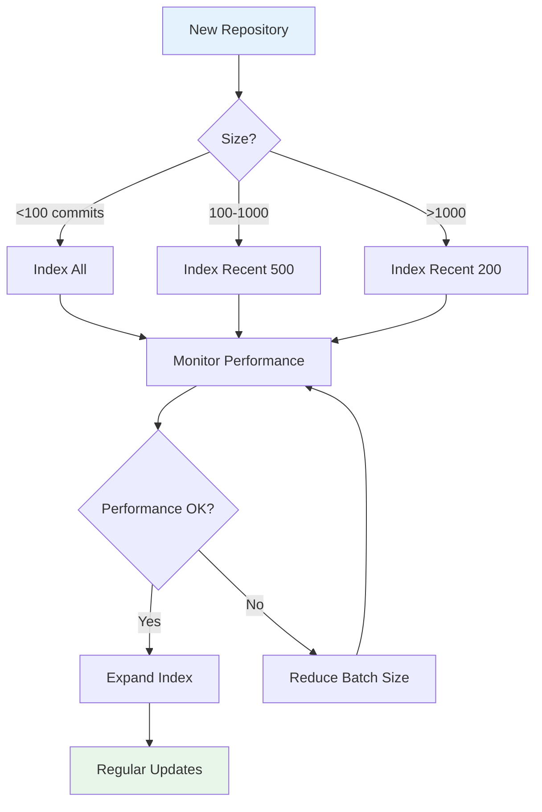

### 2. Query Writing Tips

**Good Queries:**
- "authentication bug fixes"
- "database migration changes"
- "API rate limiting implementation"

**Poor Queries:**
- "bug" (too broad)
- "fix issue #1234" (too specific)
- "change code" (too vague)

### 3. Maintenance Schedule

```bash
# Weekly: Update index with new commits
gitforai index ~/repos/project/

# Monthly: Check database stats
gitforai db-stats

# As needed: Clear cache if disk space is low
gitforai clear-cache
```

---

## FAQ

### Q: Is my code sent to any external servers?

**A:** Only if you choose to use OpenAI embeddings (`--embedding-provider openai`). By default, GitForAI uses local embeddings that run entirely on your machine. Your code never leaves your computer.

### Q: How much disk space does GitForAI use?

**A:**
- Local embedding model: ~80MB (one-time download)
- Vector database: ~1-5MB per 1000 commits (varies by commit size)
- Cache: ~1-10MB per 1000 commits

### Q: Can I use GitForAI on private repositories?

**A:** Yes! GitForAI works with any Git repository on your local machine, private or public.

### Q: How accurate is semantic search?

**A:** With local embeddings, semantic search achieves ~85-90% relevance. With OpenAI embeddings, this increases to ~92-95%.

### Q: Can I search across multiple repositories?

**A:** Currently, each repository is indexed separately. Multi-repo search is planned for a future release.

### Q: What languages are supported?

**A:** GitForAI works with any programming language. The semantic analysis understands code in any language that uses Git.

---

## Support

- **Documentation**: See [README.md](README.md) for overview
- **Implementation Details**: See [implementation-plan.md](implementation-plan.md)
- **Issues**: Report bugs at [GitHub Issues](https://github.com/yourusername/gitforai/issues)
- **Contributing**: See [CONTRIBUTING.md](CONTRIBUTING.md)

---

**Version:** 3.0
**Last Updated:** 2025-11-06
**Status:** Phase 3 Complete - Vector Database Integration with CLI
